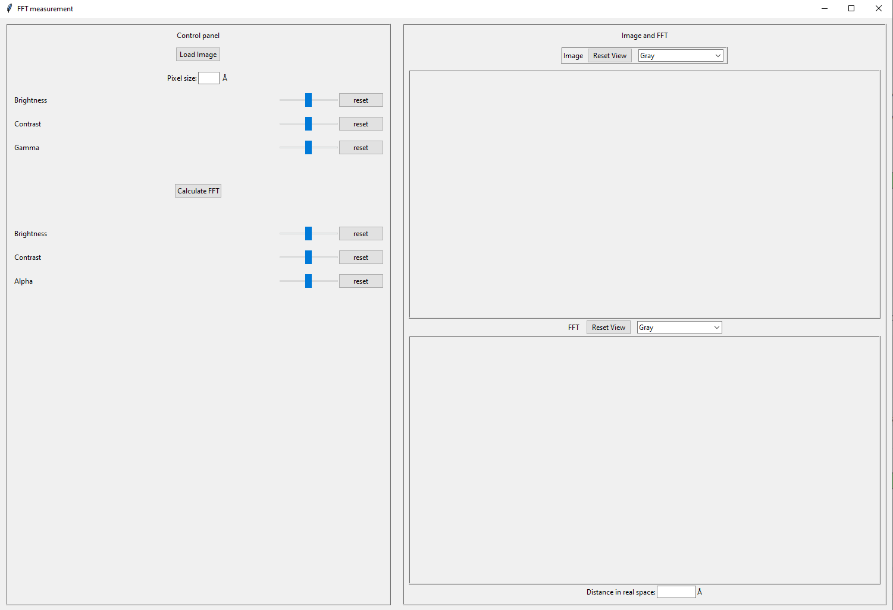
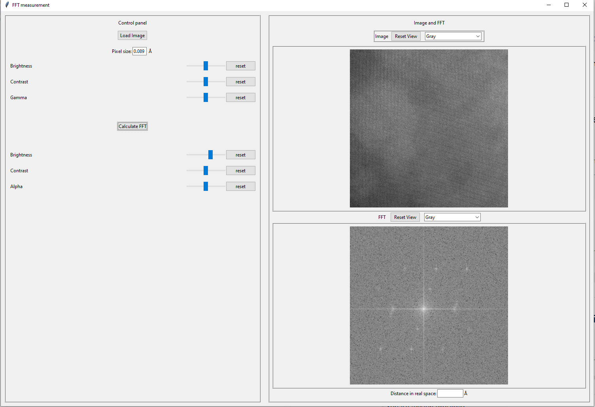
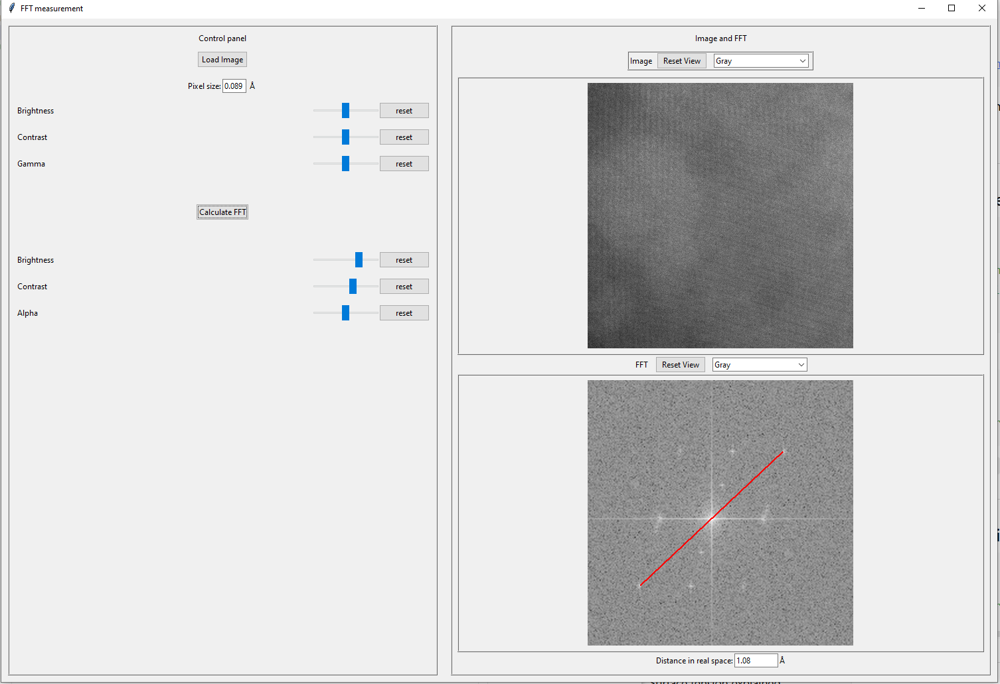

# A tinkter-based GUI to perform FFT on the EM images

**Measure in FFT pattern and calculate corresponding spatial distance**

**Environments:**
environments.yaml

**Scripts:**
Run FFT_measure.py in terminal to start the program  

**Start program:**  

    

**Load image:**

    

**FFT of the loaded image:**  

    

**Meaure in frequency domain and calculate corresponding spatial distance:**

    

More functions such as high/loss pass filter, line profile in real space image can be added later

